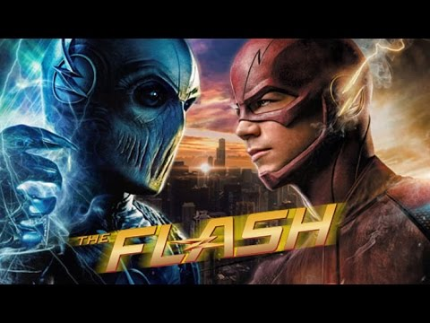

# Super Hero Dueler




	
## Wonders and Perils Await

There are times when the powers of good and evil come together in a mighty clash of force. When this happens, it's up to all of us to make sure that we make every one of our assets count. What better than a simulation to make sure you have the best team with you when the time comes to stand up to the evil forces of the galaxy's greatest foes.

Our task is to create a superhero team dueling application so we can be sure we've got the best people to fight evil with. This time we're going to use Object Oriented Programming to build our applications instead of relying completely on functions.


	features:
	
	* Object-oriented programming (OOP) 
	* Terminal Run Base


## Usage

Clone our repo and then run using

```sh
python3 superhero.py
```


## Meta

Distributed under the MIT license.


Mo's Channel - https://www.youtube.com/channel/UCBTVuaTf-Ui5qSgvrOnaqig

Mo's Github - https://github.com/mdrame


<!-- Markdown link & img dfn's -->
[python3-image]: https://img.shields.io/badge/-python3-brightgreen
[MIT]: https://img.shields.io/badge/License-MIT-blue

